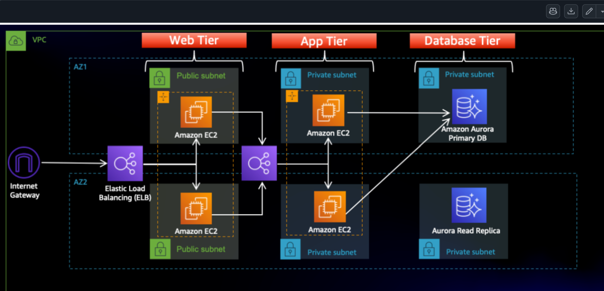

# Terraform Three-Tier Architecture on AWS

This repository contains Terraform code to provision a complete three-tier architecture on AWS including:

- One VPC  
- 6 Subnets (2 Public, 4 Private)  
- Internet Gateway (IGW)  
- NAT Gateway with Elastic IP  
- External (Public) Load Balancer  
- Internal (Private) Load Balancer  
- EC2 Instances / Auto Scaling Groups  
- RDS Database  
- Proper Security Groups  
- Remote Backend using S3  

---

## Architecture Overview

---

## Prerequisites

### 1. AWS Account
You must have an active AWS account.

### 2. Install Required Tools

- Terraform >= 1.x  
- AWS CLI >= 2.x  
- Git  

Verify:

---

### 3. Configure AWS CLI

Provide:

- AWS Access Key ID  
- AWS Secret Access Key  
- Default region (example: us-east-1)  
- Output format: json  

Verify:

---

### 4. Create S3 Bucket for Terraform Backend (Mandatory)

Terraform backend bucket must exist before running Terraform.

---

### Update locals.tf or variables.tf

Update values such as:

- Region  
- Key pair name  
- VPC CIDR  
- Public subnet CIDRs  
- Private subnet CIDRs  
- Instance type  
- Database name  
- Database username  
- Database password  

Example:

---

## Deployment Steps

### Initialize Terraform

terraform init
terraform fmt
terraform validate
terraform plan
terraform apply

###   To removing the resources post testing

terraform destroy
